# Lab Session 2&3

**Made by:**

- Zijie NING @[mm0806son](https://github.com/mm0806son)
- Guoxiong SUN @[GuoxiongSUN](https://github.com/GuoxiongSUN)

-----

## Part 1 Pruning

### 1. VGG Global Pruning, no retrain 

We started by pruning on a VGG-11 network which is trained by us before. We observed that the accuracy dropped significantly after a certain point. We also saw a quite big oscillation at around a pruning rate of 85%.

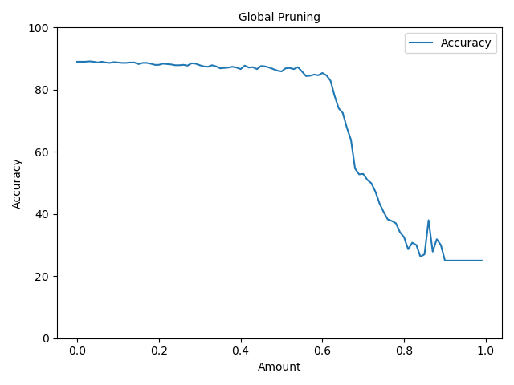

We tried to zoom in to see this phenomenon.

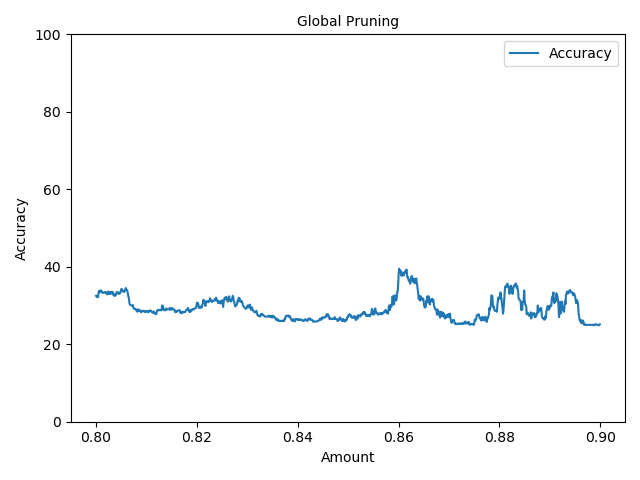

### 2. Densenet Global Pruning, no retrain

According to the comparison that we mentioned last time, we decided to change our network. Here we use DenseNet.

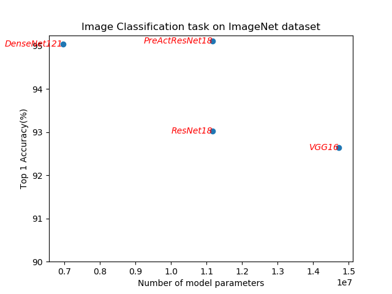

We tried to do a global pruning by using code:

```python
prune.global_unstructured(
    parameters_to_prune,
    pruning_method=prune.L1Unstructured,
    amount=0.3,
)
```

As we had done before, we plotted the impact of pruning rate on the accuracy. We then zoomed in in order to find the best pruning rate.

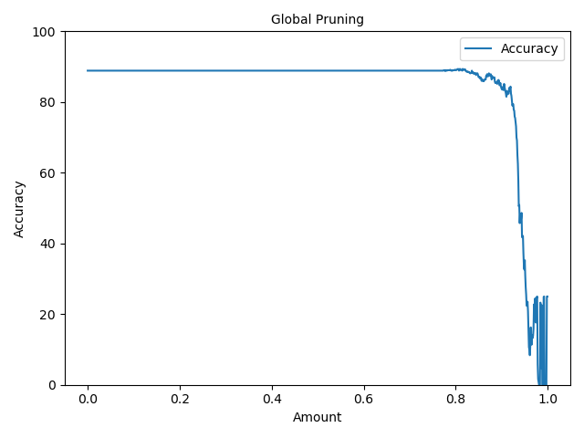

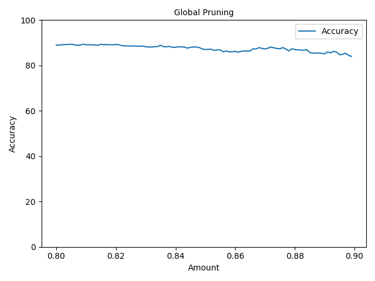

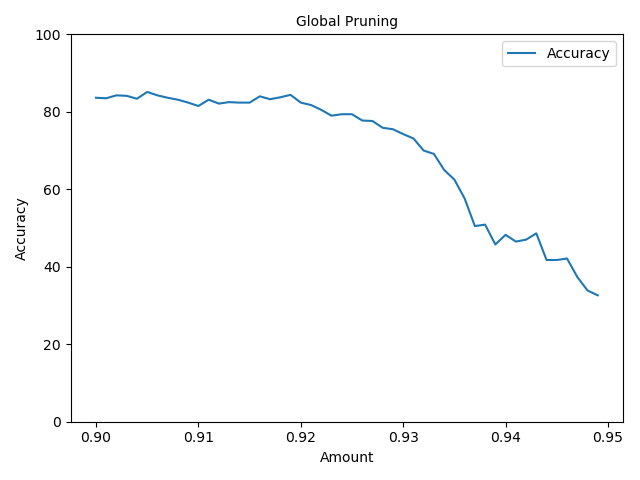

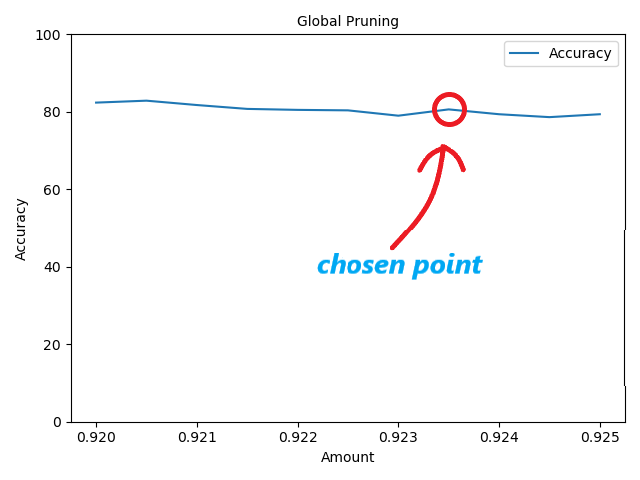


Part 2 - Reflections
--

### 1. Retrain after pruning

We tried to use a pruning rate of 0.9235. We saw that the accuracy dropped from 88.875% to 80.625%. We then tried to retrain our model after pruning, and we found a increase of performance on both models before and after pruning.

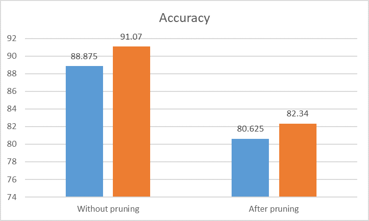

### 2. Model size

By using pruning, we get a satisfying accuracy with a much smaller network.

Memory footprint:

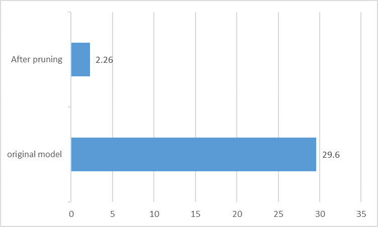

**Number of non-zero parameters before pruning:** 969281
969281\*32b=29.6Mb
**Number of non-zero parameters after pruning:**  74151
74151\*32b=2372382b=2318Kb=2.26Mb

In theory, the model should be smaller after pruning. But not yet.

Part 3 - Problems
--

### 1.binarization

The accuracy is reduced after binarization.

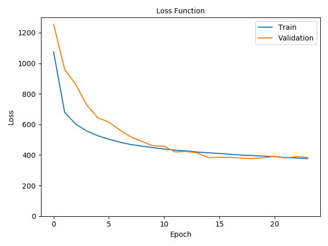

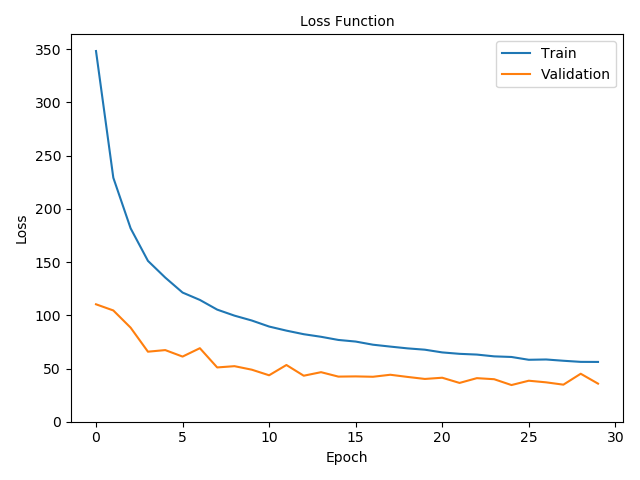

### 2.For the method：[Learning both Weights and Connections for Efficient Neural Networks](https://arxiv.org/abs/1506.02626)

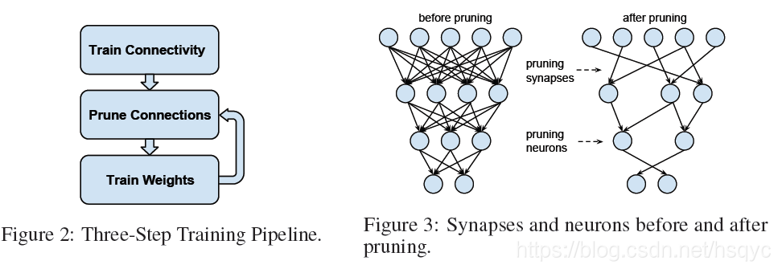

How to set the weight of subsequent pruning?


## Summary of presentation

Try to do pruning on each "bunch" of layers, by keeping the structure of network
