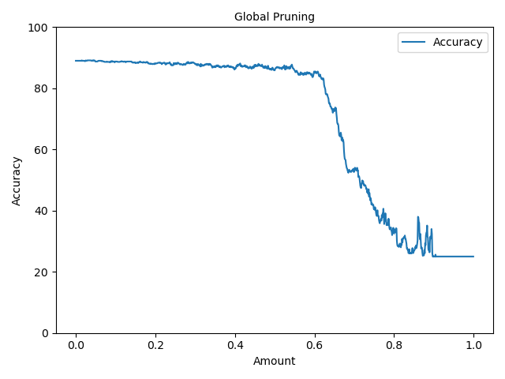

Report lab Session 3
--
The objectives of this third lab session is to perform experiments using pruning methods.

Part 1 Pruning
--

1. VGG Global Pruning, no retrain 

2. Densenet Global Pruning, no retrain

The effect after pruning

Part 2 - problem
--

1.binarization

The accuracy is reduced after binarization
(放跑完后的图)

2.For the method：[Learning both Weights and Connections for Efficient Neural Networks](https://arxiv.org/abs/1506.02626)

how to set the weight of subsequent pruning

0.9235 - 80.625% -> 82.34
Number of non-zero parameters:  74151
74151*32=2372382B=2318Kb=2.26Mb

969281 88.875% -> 91.07%
969281*32=29.6Mb